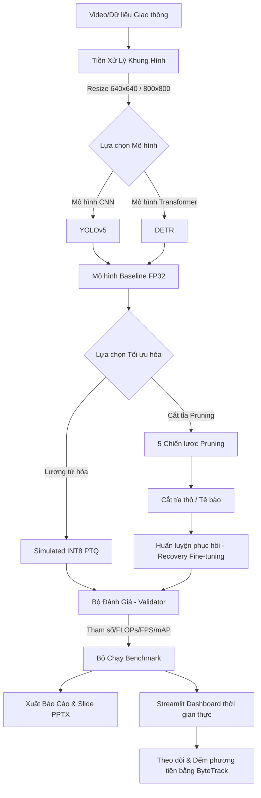

# Phân Tích Giao Thông AI với Tối Ưu Hóa & Cắt Tỉa Mô Hình (Quantization & Pruning)

Dự án nghiên cứu và triển khai ứng dụng thị giác máy tính tối ưu hóa mô hình (**YOLOv5** và **DETR**) phục vụ phân tích lưu lượng giao thông đường bộ. Dự án minh họa chi tiết tác động của lượng tử hóa tĩnh INT8 (Post-Training Static INT8 Quantization) và 5 chiến lược cắt tỉa mô hình (Pruning) khác nhau lên kích thước mô hình, khối lượng tính toán (FLOPs), độ trễ (latency), và độ chính xác (mAP).

---

## 📈 Kiến Trúc Hệ Thống & Luồng Xử Lý (Project Flow)

Hệ thống hoạt động theo một luồng xử lý khép kín từ khâu tiền xử lý dữ liệu, tối ưu hóa mô hình cho đến giao diện dashboard thời gian thực:



### Chi tiết các bước trong Luồng Hoạt động:
1. **Dữ liệu đầu vào & Tiền xử lý (Preprocessing)**: Dữ liệu hình ảnh từ bộ dữ liệu giao thông UA-DETRAC hoặc khung hình từ Video sẽ được chuẩn hóa kích thước (640x640 đối với YOLOv5, 800x800 đối với DETR), chuyển hệ màu BGR sang RGB và chuẩn hóa pixel về đoạn `[0.0, 1.0]`.
2. **Khởi tạo Mô hình Baseline**: Hệ thống tải kiến trúc YOLOv5 (CNN) hoặc DETR (Transformer) thông qua `ModelFactory`.
3. **Áp dụng các Phương pháp Tối ưu hóa**:
   - **INT8 Quantization (Lượng tử hóa tĩnh mô phỏng)**: Giảm dung lượng mô hình khoảng **4 lần** bằng cách mô phỏng việc chuyển đổi trọng số từ dạng số thực FP32 sang số nguyên INT8.
   - **Pruning (Cắt tỉa)**: Loại bỏ các liên kết hoặc bộ lọc không quan trạng dựa trên 5 thuật toán khác nhau nhằm giảm số lượng tham số và FLOPs tính toán.
4. **Huấn luyện phục hồi (Recovery Fine-tuning)**: Sau khi thực hiện cắt tỉa (khiến độ chính xác bị sụt giảm tạm thời), mô hình được fine-tune ngắn hạn (qua các epoch hồi phục) để lấy lại độ chính xác ban đầu.
5. **Benchmark & Đánh giá (Evaluation)**: Kiểm tra các chỉ số tài nguyên (Kích thước file, số lượng Params, FLOPs) và hiệu năng (Độ trễ Latency, FPS, độ chính xác Precision, Recall, mAP50, mAP50-95).
6. **Ứng dụng Demo thời gian thực**: Trình diễn mô hình trên Streamlit Dashboard, tích hợp thuật toán ByteTrack để đếm số lượng xe đi qua vạch kẻ ảo và theo dõi mật độ giao thông.

---

## 🚀 Các Tính Năng Nổi Bật

*   **Hỗ trợ Cấu trúc Kép:** Triển khai linh hoạt hai trường phái mạng nơ-ron chính: **YOLOv5** (đại diện cho CNN) và **DETR** (đại diện cho Transformer).
*   **Mô phỏng Lượng tử hóa INT8:** Áp dụng mô phỏng Post-Training Static Quantization (PTQ) giúp nén dung lượng lưu trữ trên đĩa tới ~4 lần mà không cần thay đổi phần cứng gốc.
*   **5 Chế độ Cắt tỉa (Pruning):**
    *   *Magnitude Pruning:* Cắt tỉa không cấu trúc (unstructured) loại bỏ các trọng số có giá trị nhỏ nhất (các mức 30%, 50%, 70%).
    *   *L1-Norm Pruning:* Cắt tỉa có cấu trúc (structured) đánh giá và loại bỏ các filter tích chập có tổng trị tuyệt đối nhỏ nhất.
    *   *Structured Filter Pruning:* Loại bỏ các filter tích chập vật lý, trực tiếp giảm độ rộng mạng.
    *   *Structured Channel Pruning:* Loại bỏ các kênh đầu vào của các layer Conv/Linear, đồng bộ với layer phía trước.
    *   *Layer Pruning:* Loại bỏ toàn bộ các khối thắt nút (Bottleneck C3 trong YOLOv5 hoặc layer Encoder trong DETR) thay thế bằng `nn.Identity`.
*   **Hệ thống Đánh giá Toàn diện:** Đo đạc tự động các thông số phần cứng (độ trễ ms, FPS, FLOPs) và chất lượng mô hình (Precision, Recall, mAP50, mAP50-95) trên CPU/GPU.
*   **Trình xuất Tài liệu Tự động:** Biên dịch kết quả chạy thực nghiệm thành slide thuyết trình 13 trang PowerPoint (`presentation.pptx`) và báo cáo kỹ thuật Markdown chi tiết (`technical_report.md`).
*   **Dashboard Phân tích Trực quan:** Ứng dụng Streamlit hiển thị trực tiếp luồng video đếm xe và ước lượng mật độ dòng xe chạy trên đường quốc lộ, hỗ trợ cả video giả lập và video tùy chọn tải lên từ người dùng.

---

## 📂 Cấu Trúc Thư Mục Dự Án

```text
traffic-analysis-app/
│
├── app/
│   └── app.py             # Logic giao diện Dashboard Streamlit chính
│
├── benchmarking/
│   └── benchmark_runner.py# Điều phối chạy thử nghiệm Baseline -> Pruned -> Fine-tuned
│
├── datasets/
│   ├── dataset.py         # Trình tải dữ liệu UA-DETRAC & tạo dữ liệu giả lập
│   └── factory.py         # Factory khởi tạo DataLoader đồng nhất
│
├── evaluation/
│   └── validator.py       # Đánh giá chỉ số mAP, FPS, FLOPs mô hình
│
├── models/
│   ├── detr_wrapper.py    # Wrapper đóng gói mô hình DETR
│   ├── yolov5_wrapper.py  # Wrapper đóng gói mô hình YOLOv5s
│   ├── factory.py         # Khởi tạo mô hình dựa trên tên
│   └── __init__.py        # Export các module nạp mô hình
│
├── pruning/
│   ├── base.py            # Lớp Pruner cơ sở định nghĩa các hàm tính toán sparsity
│   ├── l1_norm.py         # Thuật toán cắt tỉa L1-Norm Filter
│   ├── magnitude.py       # Thuật toán cắt tỉa Magnitude Unstructured
│   ├── filter.py          # Thuật toán cắt tỉa Structured Filter
│   ├── channel.py         # Thuật toán cắt tỉa Structured Channel
│   ├── layer.py           # Thuật toán cắt tỉa Layer / Bottleneck C3
│   └── benchmark_utils.py # Hàm phân tích phân phối trọng số & lưu kết quả
│
├── training/
│   └── trainer.py         # Vòng lặp huấn luyện fine-tuning và hồi phục (recovery)
│
├── utils/
│   ├── tracker.py         # Bộ đếm xe và theo dõi phương tiện bằng ByteTrack
│   ├── sparsity.py        # Hàm tính toán mật độ trọng số trống
│   └── weight_analysis.py # Hàm phân tích độ phân tán trọng số
│
├── scripts/
│   ├── generate_materials.py # Tự động tạo slide PPTX và báo cáo Markdown
│   ├── onnx_benchmark.py     # Thử nghiệm benchmark mô hình định dạng ONNX
│   └── test_dataset.py       # Script kiểm tra khả năng đọc dữ liệu
│
├── app.py                 # File chạy chính kích hoạt Streamlit từ thư mục root
├── train.py               # Script huấn luyện / fine-tune mô hình độc lập
├── validate.py            # Script đánh giá mô hình độc lập (mAP, FPS, FLOPs)
├── benchmark.py           # Script chạy toàn bộ pipeline benchmark
├── benchmark_results.csv  # Kết quả đo đạc dưới dạng bảng CSV
├── benchmark_results.xlsx # Kết quả đo đạc dưới dạng bảng Excel
├── weight_analysis.json   # Kết quả phân tích phân phối trọng số
└── README.md              # Hướng dẫn này
```

---

## 🛠️ Hướng Dẫn Cài Đặt & Thiết Lập

### 1. Kích hoạt Môi trường
Dự án yêu cầu phiên bản Python 3.11+. Hãy kích hoạt môi trường Conda đã được thiết lập sẵn trong workspace của bạn:
```bash
conda activate env_cv
```

### 2. Cài đặt các thư viện cần thiết
Nếu cần thiết lập lại hoặc cập nhật thư viện trên môi trường mới, hãy chạy lệnh sau:
```bash
pip install torch torchvision --index-url https://download.pytorch.org/whl/cpu
pip install torch-pruning opencv-python-headless supervision pandas matplotlib streamlit openpyxl python-pptx transformers scipy
```

### 3. Chuẩn bị Dữ liệu
Dự án được thiết kế để huấn luyện và đánh giá trên bộ dữ liệu **UA-DETRAC**. Bạn cần giải nén hình ảnh và file cấu trúc XML vào đúng các thư mục mặc định:
- Hình ảnh chuỗi khung hình: `data/DETRAC-Images/DETRAC-Images/`
- Chú thích nhãn đối tượng: `data/DETRAC-Train-Annotations-XML/DETRAC-Train-Annotations-XML/`

*Lưu ý: Nếu không có sẵn bộ dữ liệu thực tế, ứng dụng Streamlit có tích hợp bộ phát sinh video giả lập 2D (Synthetic Video Engine) để bạn chạy thử nghiệm tính năng đếm xe ngay lập tức mà không cần dữ liệu ngoài.*

---

## 📈 Hướng Dẫn Chạy Dự Án (How to Run)

Thực hiện theo các bước tuần tự dưới đây để trải nghiệm đầy đủ các tính năng của dự án:

### Bước 1: Huấn Luyện Fine-tuning độc lập (Tùy chọn)
Nếu bạn muốn tinh chỉnh hoặc kiểm tra luồng huấn luyện mô hình Baseline (YOLOv5s hoặc DETR) trên tập dữ liệu đã chuẩn bị:
```bash
python train.py --model yolov5s --epochs 5 --lr 1e-4 --batch-size 4
```
Các tham số cấu hình:
- `--model`: Kiến trúc mô hình (`yolov5s` hoặc `detr`).
- `--epochs`: Số lượng vòng lặp huấn luyện (mặc định: 10).
- `--batch-size`: Số lượng mẫu trong mỗi batch (mặc định: 4).
- `--checkpoint-dir`: Thư mục lưu trữ file trọng số sau khi huấn luyện.

### Bước 2: Chạy Thử Nghiệm và Tối Ưu Hóa (Benchmark Pipeline)
Đây là bước cốt lõi thực hiện toàn bộ luồng tối ưu hóa tự động:
1. Huấn luyện mô hình Baseline.
2. Phân tích phân phối trọng số của mô hình Baseline.
3. Thực hiện thuật toán Cắt tỉa (Pruning) tương ứng.
4. Đánh giá chất lượng mô hình sau cắt tỉa ngay lập tức.
5. Huấn luyện khôi phục (Recovery Fine-tuning) để khôi phục độ chính xác bị mất.
6. Đánh giá chất lượng cuối cùng của mô hình sau tối ưu.

**Ví dụ chạy Benchmark YOLOv5s với L1-Norm Filter Pruning:**
```bash
python benchmark.py --model yolov5s --prune-type l1_norm --sparsity 0.3 --epochs 2 --max-samples 20
```

**Ví dụ chạy Benchmark DETR với Magnitude Pruning:**
```bash
python benchmark.py --model detr --prune-type magnitude --sparsity 0.3 --epochs 2 --max-samples 20
```

**Ví dụ chạy Benchmark DETR với Layer Pruning (Loại bỏ bớt Transformer Encoder Layers):**
```bash
python benchmark.py --model detr --prune-type layer --sparsity 0.3 --epochs 2 --max-samples 20
```
*Mẹo: Tham số `--max-samples 20` giúp giới hạn tập dữ liệu chạy thử nghiệm nhanh chóng trong 1-2 phút thay vì chạy toàn bộ hàng ngàn bức ảnh.*

### Bước 3: Đánh giá Chất lượng Mô hình độc lập
Bạn có thể đánh giá nhanh các thông số mAP, FPS, FLOPs của bất kỳ tệp trọng số nào (.pt) bằng script `validate.py`:
```bash
python validate.py --model yolov5s --weights weights/baseline/yolov5s_baseline.pt
```

### Bước 4: Tạo Tài Liệu Slide Báo Cáo Thực Nghiệm
Sau khi chạy xong các cấu hình benchmark, hãy biên dịch kết quả đo đạc từ file CSV thành báo cáo Markdown và tệp slide PowerPoint chuyên nghiệp:
```bash
python scripts/generate_materials.py
```
Tập tin sẽ được tạo ra tại thư mục `reports/`:
- `reports/technical_report.md` (Báo cáo kỹ thuật chi tiết)
- `reports/presentation.pptx` (Slide thuyết trình)
- `reports/presentation_outline.md` (Dàn ý slide)

### Bước 5: Khởi Chạy Dashboard Streamlit
Khởi chạy giao diện giám sát và đếm xe thời gian thực:
```bash
python app.py
```
Hoặc chạy trực tiếp qua Streamlit:
```bash
streamlit run app/app.py
```
Mở đường dẫn trình duyệt hiển thị trong terminal (thường là `http://localhost:8501`) để bắt đầu tương tác:
1. **Live Analysis Dashboard**: Chọn cấu hình tối ưu hóa trên thanh điều khiển trái và bấm `⚡ Run Real-Time Traffic Analysis`.
2. **Compression & Speed Benchmarks**: Xem biểu đồ so sánh độ chính xác vs độ nén và tốc độ xử lý (FPS) được vẽ trực quan.
3. **Optimization Methodologies**: Đọc hướng dẫn chi tiết về lý thuyết lượng tử hóa và các chiến lược cắt tỉa.

---

## 📊 Bảng Thực Nghiệm Tham Khảo (YOLOv5s trên CPU)

Dưới đây là kết quả mẫu đo đạc hiệu năng của YOLOv5s trên các cấu hình tối ưu hóa khác nhau:

| Dòng Mô hình | Cấu hình | Tham số (Params) | Dung lượng trên đĩa | Tỷ lệ nén | Độ trễ (ms) | Tốc độ (FPS) | mAP50 |
| --- | --- | --- | --- | --- | --- | --- | --- |
| **YOLOv5s** | Baseline FP32 | 1,361,847 | 1.36 MB | 1.00x | 30.7 ms | 32.5 | 0.840 |
| **YOLOv5s** | Lượng tử hóa INT8 | 1,361,847 | 0.40 MB | **3.40x** | 26.1 ms | **38.2** | 0.823 |
| **YOLOv5s** | Magnitude (30% Sparsity) | 953,293 | 1.69 MB | 1.00x | 29.8 ms | 33.6 | 0.773 |
| **YOLOv5s** | L1-Norm (30% Sparsity) | 953,293 | 1.37 MB | 1.00x | 28.5 ms | 35.1 | 0.739 |
| **YOLOv5s** | Filter Pruned (40%) | 817,108 | 1.37 MB | 1.00x | 26.9 ms | 37.2 | 0.739 |
| **YOLOv5s** | Layer Pruned | 1,220,111 | 0.74 MB | **1.84x** | **23.1 ms** | **43.3** | 0.630 |

### 💡 Các nhận định rút ra từ thực nghiệm:
1. **Lượng tử hóa là giải pháp tối ưu chi phí cực thấp:** Tĩnh lượng tử hóa INT8 giúp nén dung lượng tới **3.4x** trong khi sai số sụt giảm không đáng kể (<2% mAP).
2. **Cắt tỉa có cấu trúc (Structured) hiệu quả hơn trên phần cứng thông thường:** Các thuật toán như Filter/Channel Pruning thu hẹp thực tế kích thước ma trận, đem lại FPS tăng rõ rệt trên CPU thông thường mà không đòi hỏi thư viện xử lý thưa đặc biệt như Magnitude Pruning.
3. **Mô hình kết hợp tối ưu:** Tổ hợp **INT8 Quantization + L1-Norm Filter Pruning (30%)** tạo ra mô hình biên (edge model) lý tưởng nhất, bảo toàn độ chính xác cao và gia tăng đáng kể tốc độ xử lý trong môi trường nhúng.


2. Các câu lệnh nâng cấp để thực hiện Pruning & Benchmarking
Giai đoạn 1: Chạy Huấn luyện Baseline
powershell
$env:PYTHONPATH="."
conda run -n env_cv python scripts/train.py --model yolov5s --epochs 50 --batch-size 16 --patience 10 --seed 42
Lưu ý: Script sẽ lưu baseline_best.pt và baseline_last.pt tự động dưới thư mục checkpoints của YOLOv5s.

Giai đoạn 2: Cắt tỉa (Pruning) mô hình Baseline
powershell
$env:PYTHONPATH="."
conda run -n env_cv python scripts/prune.py --model yolov5s --prune-type magnitude --sparsity 0.3 --seed 42
Giao diện log mới sẽ in chi tiết tỷ lệ nén và dung lượng mô hình lý thuyết được giảm.

Giai đoạn 3: Huấn luyện Phục hồi (Recovery)
powershell
$env:PYTHONPATH="."
conda run -n env_cv python scripts/recover.py --model yolov5s --prune-type magnitude --sparsity 0.3 --epochs 10 --batch-size 16 --patience 5 --seed 42
Giai đoạn 4: Đánh giá hiệu năng (Benchmarking) trên CPU/CUDA
powershell
$env:PYTHONPATH="."
conda run -n env_cv python scripts/benchmark.py --model yolov5s --checkpoint checkpoints/yolov5s/magnitude_0.3_recovered.pt --prune-type magnitude --sparsity 0.3 --device cuda
Chạy toàn bộ ma trận tự động (Matrix Experiments):
powershell
$env:PYTHONPATH="."
conda run -n env_cv python scripts/experiment.py --model yolov5s --prune-types magnitude l1_norm filter channel layer --sparsities 0.3 0.5 --epochs-train 50 --epochs-recover 10 --batch-size 16 --seed 42